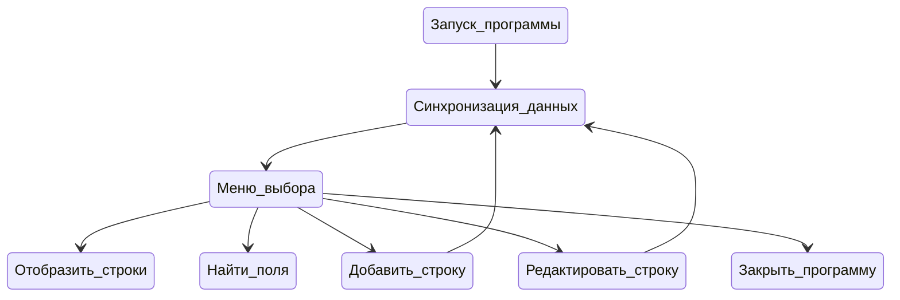

# Телефонный справочник

<details>
<summary>Ревью 2.5 года спустя</summary>

Спустя сотни часов разработки смотреть на свои первые тестовые без слёз - тяжело. 
Ниже честный разбор того, что здесь не так. 

1. open("Data.txt") вызывается без указания кодировки - Python берёт её из локали, а на русской Windows это cp1251. Сам файл лежит в UTF-8, поэтому программа может упасть с UnicodeDecodeError на первой же строке __init__, ещё до появления меню.

2. Данные в репозитории не проходят мою же валидацию.
Шаблон для текстовых полей ^[A-Za-z0-9_А-Яа-я-&]{1,40}$. Пробела в нём нет. А в Data.txt лежат "Виртуальная Лаборатория", "Созвездие Технологий", "Авангардные Решения" - эти строки нельзя ввести через саму программу. Файл с примером данных и код разошлись.

3. Рекурсия вместо главного цикла.
Меню не возвращается само в себя, а вызывает следующий шаг вложенно: initializing → input_options → add_line → initializing → и так далее. Стек растёт линейно с числом действий пользователя. show_line в конце тоже зовёт input_options, а input_options при неизвестном коде вызывает сам себя. Порядка тысячи операций -> RecursionError.

4. Пункт «выход» делает return, но возвращает управление не из программы, а на уровень выше. Работает потому, что результат никто не проверяет и раскрутка стека доходит до __main__. То есть выход из программы работает.

5. Класс, который не является классом.
Phone_Book не инкапсулирует состояние, он группирует процедуры. self.indexses создаётся не в __init__, а внутри initializing; self.editing_table и self.searching_table рождаются внутри методов. Это не поля объекта, это локальные переменные, которым приписали self, чтобы протащить между методами.

6. self.codes словарь соответствия имён полей и индексов объявлен в __init__ и не используется нигде. Хотя это ровно тот код, который должен был убрать индексы.

7. Тестовый режим внутри боевого кода.
У custom_input есть параметр test_mode, который существует только ради тестов и меняет семантику функции: в обычном режиме она зацикливается до корректного ввода, в тестовом возвращает строку "ERROR". Тесты по итогу проверяют поведение, которого в работающей программе не существует.

8. Нет модели записи.
Данные живут как list[list[str]], обращение к полям идёт по числам: line_1[search_targets], edit_list_for_edit[edit_helper]. Откуда мне два года спустя знать, что "4" это "компания". Отсюда же self.splited_list[i][0][3:] «отрезать ID_ и распарсить остаток». Формат хранения размазан по пяти методам вместо одного dataclass с from_line / to_line.

9. Поиск.
Строка, введённая пользователем, уходит прямо в re.search как шаблон. Запрос +7912 совершенно нормальный с точки зрения человека, но роняет программу с re.error. Скобка тоже. А точка находит вообще всё. Хотя для поиска подстроки регулярка не нужна.

10. Окружение и тесты.
requirements.txt это pip freeze всей машины: 29 пакетов, среди них matplotlib, numpy, pywin32, ffpyplayer, pycryptodome, openpyxl. В телефонной книге. Реальная зависимость одна prettytable. При этом chardet, который реально используется в тестах, в список не попал.

Главный вывод:
Почти всё перечисленное не отдельные баги, а следствие одного решения: программа написана как последовательность действий, а не как данные + операции над ними. 
Отсюда рекурсия вместо цикла, класс вместо модуля, списки вместо записей, тестовый режим вместо разделения слоёв.

Но вообще, хоть код явно не проходит по моим сегодняшним стандартам: оно работало, есть документация и тесты!
</details>


## Запрашиваемые возможности:
1. Вывод постранично записей из справочника на экран
2. Добавление новой записи в справочник
3. Возможность редактирования записей в справочнике
4. Поиск записей по одной или нескольким характеристикам
## Требования к программе:
1. Реализация интерфейса через консоль (без веб- или графического интерфейса)
2. Хранение данных должно быть организовано в виде текстового файла, формат которого придумывает сам программист (пример файла "Data.txt")
3. В справочнике хранится следующая информация: фамилия, имя, отчество, название организации, телефон рабочий, телефон личный (сотовый)

## Информация о программе:
Все программа выполняется внутри класса PhoneBook, поэтому при вызове "pydoc ./phone_book.py" из командной строки, вы можете получить доступ к аннотациям и документации каждой функции внутри программы.

Базовый функционал включает в себя:

***1. Просмотр*** содержания таблицы с выводом заданного количества строк или целиком и возможностью ***сортировки*** содержимого

***2. Поиск*** внутри файла по одному или нескольким полям

***3. Добавление*** новой строки в конец файла

***4. Редактирование/удаление*** строки из файла

NOTE:
Каждая из перечисленных опций, после выполнения запроса, возвращается в начальное меню, где может быть выбрана следующая операций или произведен выход из программы.

Навигация внутри программы осуществляется путем ввода числовых кодов, выбор полей для редактирования - путем ввода индексов соответствующих полей.

Для отображения таблиц в консоли используется библиотека prettytable

### Демо с использованием функций


https://github.com/Dopelen/Phone_book/assets/141639888/b3e4290c-6a21-446f-a3c3-4281a82c8cf4


### Запуск программы
Помимо стандартных модулей python, внутри программы используется модуль [PrettyTable](https://pypi.org/project/prettytable/)

Он может быть установлен через консоль командой: 

```python
python -m pip install -U prettytable'
```

Доступна установка с использованием requirements.txt:
```python
pip install -r requirements.txt
```


*P.S: Также убедитесь, что ширина консоли соответствует ширине содержания таблицы, иначе формат отображения может быть не оптимальным.*


### Блок-схема работы функций




### Структура файла Data.txt:
Разделитель между полями "\t"

1-ый стобец содержит уникальный идентификатор строки в формате: "ID_*уникальное_число*"

Остальные поля идут в порядке: фамилия, имя, отчество, название организации, телефон рабочий, телефон личный (сотовый)

Пример строки в raw формате:

*ID_2\tСудакова\tМарьяна\tРобертовна\tВиртуальная Лаборатория\t+72345678901\t+79023456789\n*


### Unit тесты ввода 

Проведены при помощи библиотеки pytest и находятся в файле

"test_input_phone_book.py"

При тестировании блокируется через фикстуру функция initialize, для предотвращения вывода меню и возможных ошибок связанны с этим. 

Тестирование числового ввода проведено через замену оригинальной функции built-in input() на moc-функцию mock_input() (скорее ради интереса, чем практической необходимости)

Тестирование прочих полей симулирует ввод пользователя передачей строки внутрь функции.

Помимо тестов ввода, в файле присутствует тест на проверку кодировки файла.
